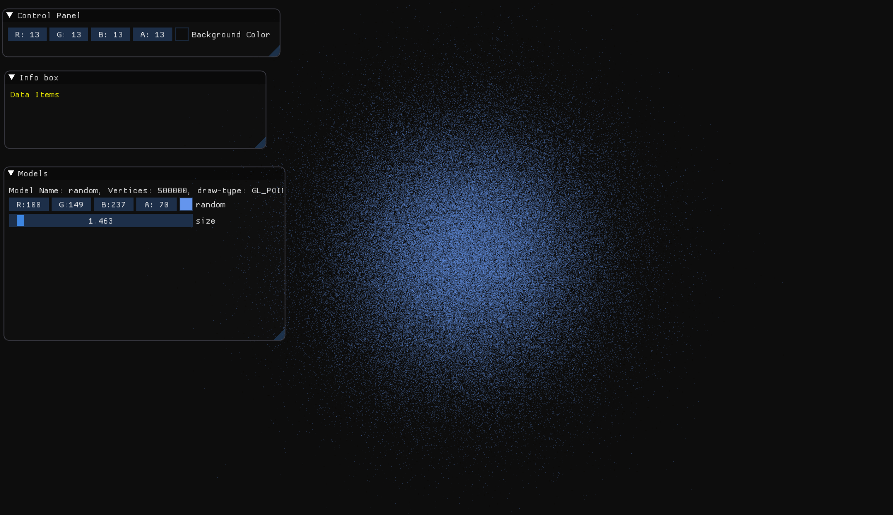
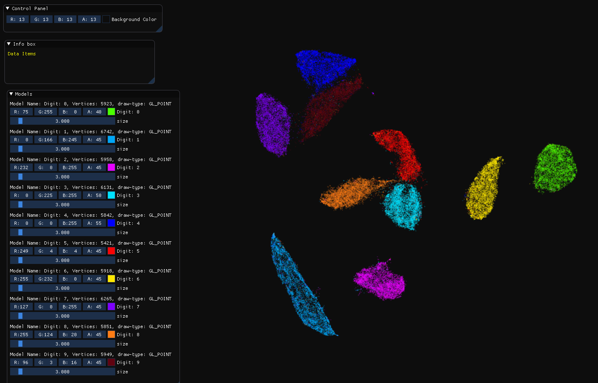
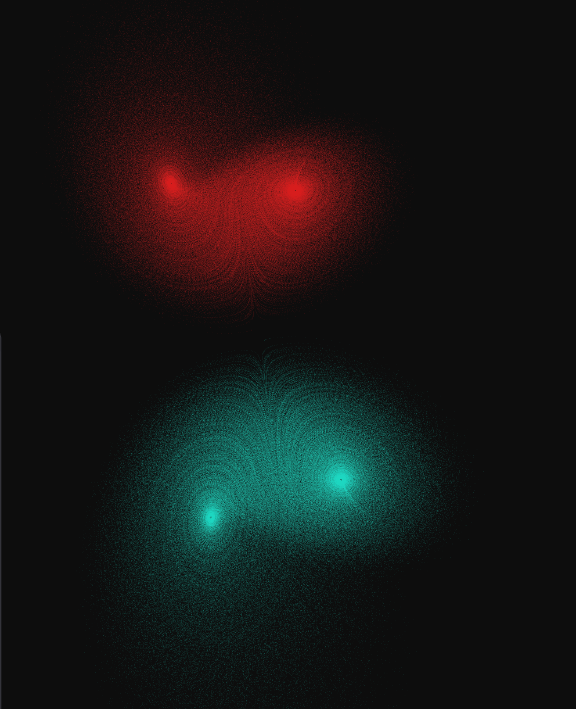

# Zenith

A high-speed graphics & plotting library for Python

### Create beautiful animated / interactive plots in Python using Zenith 


### Instructions for Mac/Linux installation

`pip install zenith-viz`

### 2D Example with random data



```Python
import numpy as np
from zenith_viz import Zenith2D, DrawStyles
plot = Zenith2D()
x_data = np.random.randn(500000)
y_data = np.random.randn(500000)
layer_idx = plot.add_layer(x_data, y_data, name="random", color="CornflowerBlue", draw_style=DrawStyles.GL_POINTS)
plot.show()
```

### 2D Example with MNIST using UMAP



 - Requires UMAP (Uniform Manifold Approximation & Projection)

```Python
!pip install umap-learn
!wget http://yann.lecun.com/exdb/mnist/train-images-idx3-ubyte.gz
!wget http://yann.lecun.com/exdb/mnist/train-labels-idx1-ubyte.gz

import gzip
import random
import numpy as np

from umap import UMAP 
from zenith_viz import Zenith2D, DrawStyles, color_lookup

with gzip.open('train-images-idx3-ubyte.gz', 'rb') as f:
    f.read(16)
    data = np.frombuffer(f.read(), dtype=np.uint8).reshape(60000, -1) 

with gzip.open('train-labels-idx1-ubyte.gz', 'rb') as f:
    f.read(8)
    labels = np.frombuffer(f.read(), dtype=np.uint8)
    
embedder = UMAP()
embedding = embedder.fit_transform(data)

plot = Zenith2D()
for label in range(10):
    vertex_data = embedding[labels==label]
    color = color_lookup[random.choice(list(color_lookup.keys()))]
    plot.add_layer(vertex_data[:,0], vertex_data[:, 1], name="Digit: " + str(label), color=color, draw_style=DrawStyles.GL_POINTS)
plot.show()
```

### 3D Something Cute


```Python
import numpy as np
from zenith_viz import Zenith3D, DrawStyles

def guess_what_i_am(x, y, z, s=10, r=28, b=2.667):
    x_dot = s*(y - x)
    y_dot = r*x - y - x*z
    z_dot = x*y - b*z
    return x_dot, y_dot, z_dot
    
dt = 0.01
num_steps = 1000000
xs = np.empty(num_steps + 1)
ys = np.empty(num_steps + 1)
zs = np.empty(num_steps + 1)
xs[0], ys[0], zs[0] = (0., 1., 1.05)
for i in range(num_steps):
    x_dot, y_dot, z_dot = guess_what_i_am(xs[i], ys[i], zs[i])
    xs[i + 1] = xs[i] + (x_dot * dt)
    ys[i + 1] = ys[i] + (y_dot * dt)
    zs[i + 1] = zs[i] + (z_dot * dt)
   
plot = Zenith3D()
plot.add_layer(xs, ys, zs, color=(218, 32, 32, 38), name="What Am I (+)", draw_style=DrawStyles.GL_POINTS)
plot.add_layer(-xs, -ys, -zs, color=(32, 213, 218, 40), name="What Am I (-)", draw_style=DrawStyles.GL_POINTS)
plot.show()

```
